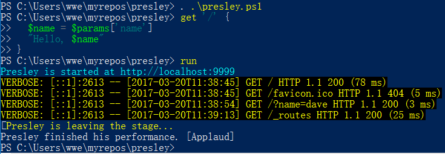

# Presley

Presley is a [DSL](https://en.wikipedia.org/wiki/Domain-specific_language) for
quickly creating web applications in PowerShell with minimal effort on Windows:

```powershell
# myapp.ps1
. .\presley.ps1

get '/' {
  'love me tender'
}

run
```

And start the application:

```powershell
PS> .\myapp.ps1
```

View at: [http://localhost:9999/](http://localhost:9999/)



>Todo:
> Next step is to wrap functionalities into a container (either class or module).
> Then to make it downloadable from PowerShellGallery


## Routes

In Presley, a route is an HTTP method paired with a URL-matching pattern.
Each route is associated with a block:

```powershell
get '/' {
  .. show something ..
}

post '/' {
  .. create something ..
}

put '/' {
  .. replace something ..
}

delete '/' {
  .. annihilate something ..
}
```

Routes are matched in the order they are defined. The first route that
matches the request is invoked.

Route patterns may include named parameters, accessible via the
`$params` hash:

```powershell
get '/hello/:name' {
  # matches "GET /hello/foo" and "GET /hello/bar"
  # $params['name'] is 'foo' or 'bar'
  "Hello $params['name']"
}
```

You can also access all parameters via `param` keyword inside blocks:

```powershell
get '/hello/:name' {
  param($arg)
  
  # matches "GET /hello/foo" and "GET /hello/bar"
  # $arg['name'] is 'foo' or 'bar'
  "Hello $($arg['name'])!"
}
```

Routes may also utilize query parameters:

```powershell
get '/posts' {
  # matches "GET /posts?title=foo&author=bar"
  $title  = $params['title']    # => 'foo'
  $author = $params['author']   # => 'bar'
  
}
```

> `$params` contains more than query or path variables: form data in POST/PUT requests.   
Further more, pre-defined variable `$body` contains content in POST body. 

## halt and redirect_to
Built-in function `halt` can stop processing and respond at once:
```powershell
get '/halt' {
  halt @{code = 404; body = "you'll never find"}
}
```

Another built-in function, `redirect_to` can redirect clients to a relative path:
```powershell
get '/goto' {
  redirect_to '/'    # => send 302 and Location='/' to clients
}
```

## Return Values

The return value of a route block determines at least the response body passed
on to the HTTP client.   

Most commonly, this is a string, as in the above examples. But other values are
also accepted. You can return any object that would either be converted to a string.

Further more, you can return a hashtable with 'headers (hashtable)', 'code (Int)'
and 'body (string)', like:

```powershell
get '/' {
  @{ 
    headers = @{ 'Content-Type' = 'application/json' };
    code    = 200;
    body    = "{ 'name':'dave', 'age':26 }"
  }
}
```

> In PowerShell, the value of the last statement in a block would be the 'return' value
of that block.

### Return as JSON

You can use `json` function to quickly create a response hash for JSON data:

```powershell
get '/date' {
  json $(Get-Date)
}
```

> It uses `ConvertTo-Json` cmdlet behind the curtain.


## Views / Templates

Each template language is exposed via its own rendering method. These
methods simply return a string:

```powershell
get '/' {
  eps 'index'
}
```

This renders `template/index.eps`.

Instead of a template name, you can also just pass in the template content
directly:

```powershell
get '/' {
  $code = "<%= $(Get-Date).ToString('s') %>"
  eps $code
}
```

> This may be not implemented yet.

#### Available Template Languages

So far only EPS adapter is implemented. You should install EPS before using this way rendering:

```powershell
PS> Install-Module EPS
```

#### Sample EPS Templates
```html
<h1><%= $name %></h1>
<h2><%= $age %></h2>

<ul>
  <% 1..5 | % { %>
  <li><%= $_ %></li>
  <% } %>
</ul>
```
might output:
```html
<h1>dave</h1>
<h2>26</h2>

<ul>
  <li>1</li>
  <li>2</li>
  <li>3</li>
  <li>4</li>
  <li>5</li>
</ul>
```

#### Accessing Variables in Templates

Templates are **NOT** evaluated within the same context as route handlers. Instance
variables set in route handlers should passed to templates:

```powershell
get '/:id' {
  $foo = $params['id']
  eps 'products' @{ id = $foo }
}
```

>For more information, please go to [project EPS in github](https://github.com/straightdave/eps)

### Setting Body, Status Code and Headers

Very similar to Sinatra, other than only returning a string as response body, 
you can return a hashtable which contains headers, status code and body text:

```powershell
get '/foo' {
  $response = @{}
  $response["code"] = 233
  $response["headers"] = @{ "Content-Type" = "application/json"; h33 = "2333333"}
  $response["body"] = "[{'name':'dave'}, {'name':'davide'}]"

  $response
}
```

Or simply:

```powershell
get '/bar' {
  @{ 
    headers = @{'ContentType' = 'application/json'}
    body    = "{`"msg`":`"a msg`"}"
  }
}
```

### Contribute
Anything is welcomed.

Author: eyaswoo@gmail.com
